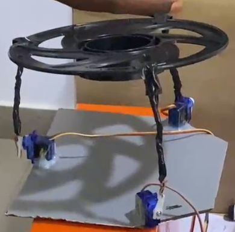
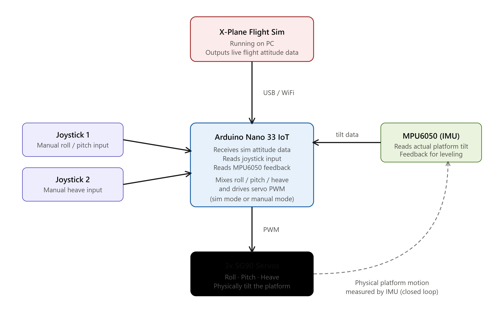
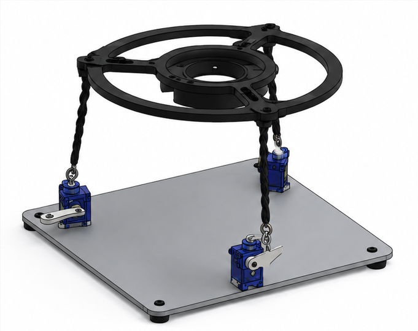
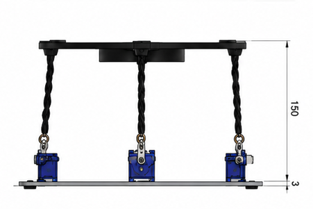

# 3-DOF Stewart Platform with X-plane Simulation

A compact **3-Degree-of-Freedom (3-DOF) Stewart Platform** designed and developed as a mechatronics engineering project. The system uses three servo actuators to control the platform's **pitch, roll, and heave** motions.

The platform is controlled using an **Arduino Nano 33 IoT**, with joystick inputs providing manual control and an **MPU6050 IMU** providing orientation feedback for potential stabilization and closed-loop control. The Platform is integrated with a **X-plane** flight simulator platform.  

---

## 📸 Project Preview

---

## Demonstration

> Add a demonstration GIF or video here.

<!-- Example:

-->

**Video:** [Watch the demonstration](#)

---

## Project Overview

A Stewart platform is a type of parallel robotic mechanism that uses multiple actuators to control the position and orientation of a moving platform.

This project implements a simplified **3-DOF Stewart platform** using three servo motors. By coordinating the movement of the three actuators, the platform can produce:

- **Roll** – rotation about the X-axis
- **Pitch** – rotation about the Y-axis
- **Heave** – vertical movement along the Z-axis

The project combines mechanical design, electronics, embedded programming, sensor integration and control systems.

---

## Objectives

The main objectives of this project are to:

- Design and construct a functional 3-DOF Stewart platform.
- Implement coordinated control of three servo actuators.
- Develop joystick-based manual control.
- Integrate an MPU6050 inertial measurement unit.
- Implement sensor-based orientation feedback.
- Explore the control and kinematics of parallel robotic mechanisms.
- Develop a modular platform that can be expanded for more advanced control strategies.
- Fully integrate it with a Flight simulator platform.

---

## System Architecture

---

## Hardware

| Component | Quantity | Purpose |
|---|---:|---|
| Arduino Nano 33 IoT | 1 | Main controller |
| SG90 Servo Motors | 3 | Platform actuation |
| PCA9685 | 1 | Servo driver |
| MPU6050 | 1 | Orientation sensing |
| 2-Axis Joystick | 2 | Manual user input |
| 5V External Power Supply | 1 | Servo power |
| Mechanical Platform | 1 | Stewart platform mechanism |

> **Note:** The servo motors are powered from an external 5V supply rather than directly from the Arduino.

---

## Degrees of Freedom

The platform currently provides three degrees of freedom:

### Roll

The platform rotates around the X-axis.

The servos move in coordinated directions to tilt the platform laterally.

### Pitch

The platform rotates around the Y-axis.

The actuator positions are adjusted to tilt the platform forward or backward.

### Heave

All three actuators move together to raise or lower the platform.

## Control System

The platform can be controlled using two 2-axis joysticks.

The joystick inputs are mapped to the desired platform movements:

### Motion Mapping

| Motion | Servo Behaviour |
|---|---|
| Roll | S2 and S3 move relative to S1 |
| Pitch | S1 moves relative to S2 and S3 |
| Heave | S1, S2 and S3 move together |

---

## MPU6050 Integration

The MPU6050 provides accelerometer and gyroscope measurements that can be used to determine the platform's orientation.

The sensor provides:

- Accelerometer data: X, Y, Z
- Gyroscope data: X, Y, Z

The IMU can be used for:

- Measuring platform orientation
- Detecting unwanted tilt
- Feedback control
- Automatic leveling
- Future PID control implementation

---

## Electronics

### Servo Power

The three SG90 servos should be powered from an external 5V supply.

The Arduino and servo power system must share a **common ground**.

---

## Software

The project is developed using the **Arduino IDE**, **Python** and **X-plane 11 Flight Simulator**.

### Main Libraries

- `Wire.h`
- `Adafruit_PWMServoDriver.h`
- `MPU6050 library`

---

## Safety Considerations

The platform contains moving mechanical components and should be tested carefully.

- Do not power the servos directly from the Arduino.
- Use an appropriate external 5V supply.
- Ensure all grounds are connected.
- Start testing with limited servo angles.
- Avoid forcing the platform beyond its mechanical limits.
- Secure the platform before testing.
- Disconnect power before modifying the wiring.

---

## Future Improvements

Potential improvements include:

- Full inverse kinematics implementation
- PID-based automatic stabilization
- Closed-loop position control
- Higher-torque servo/actuator systems
- Wireless control
- Web-based control interface
- Real-time orientation visualization
- 6-DOF expansion
- Improved mechanical rigidity
- Higher precision position feedback

---

## CAD models

| Front View | Side View |
|---|---|
|  |  |

| Board Sketch | 
|---|
|  |

---

## Author

**Fuad-Nasirudeen Abdussalam**

Mechatronics Engineering  
Interested in Robotics, Embedded Systems, and Industrial Automation.

---

## Support

If you find this project useful or interesting, consider giving the repository a ⭐ on GitHub.
